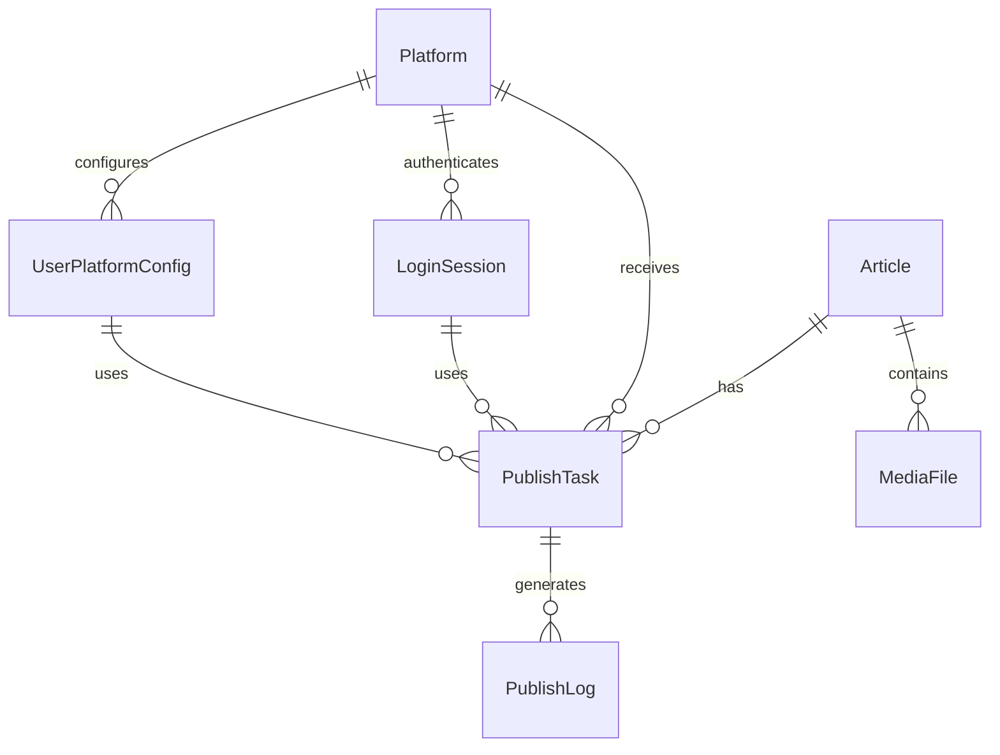

# Data Model: 文章一键多发平台

**Created**: 2025-10-14
**Based on**: Research findings and functional requirements
**Storage**: SQLite + SQLCipher (加密)

---

## Core Entities

### 1. Article (文章)
```sql
CREATE TABLE articles (
    id INTEGER PRIMARY KEY AUTOINCREMENT,
    uuid TEXT UNIQUE NOT NULL,
    title TEXT NOT NULL,
    content TEXT NOT NULL,                    -- Quill Delta格式
    html_content TEXT,                        -- 渲染后的HTML
    cover_image TEXT,                         -- 封面图片URL
    tags TEXT,                                -- JSON数组
    category TEXT,
    status INTEGER DEFAULT 0,                 -- 0:草稿 1:已发布 2:发布失败
    created_at DATETIME DEFAULT CURRENT_TIMESTAMP,
    updated_at DATETIME DEFAULT CURRENT_TIMESTAMP,
    word_count INTEGER DEFAULT 0,
    reading_time INTEGER DEFAULT 0            -- 预估阅读时间(分钟)
);
```

### 2. Platform (平台)
```sql
CREATE TABLE platforms (
    id INTEGER PRIMARY KEY AUTOINCREMENT,
    name TEXT UNIQUE NOT NULL,                -- 平台名称: zhihu, xiaohongshu等
    display_name TEXT NOT NULL,              -- 显示名称: 知乎, 小红书
    icon_url TEXT,                           -- 平台图标
    base_url TEXT NOT NULL,                  -- 平台基础URL
    login_url TEXT,                          -- 登录页面URL
    publish_url TEXT,                        -- 发布页面URL
    config_schema TEXT,                      -- JSON: 平台特定配置项
    is_active BOOLEAN DEFAULT 1,
    priority INTEGER DEFAULT 0,              -- 发布优先级
    created_at DATETIME DEFAULT CURRENT_TIMESTAMP
);
```

### 3. UserPlatformConfig (用户平台配置)
```sql
CREATE TABLE user_platform_configs (
    id INTEGER PRIMARY KEY AUTOINCREMENT,
    platform_id INTEGER NOT NULL,
    config_name TEXT NOT NULL,               -- 配置名称
    config_data TEXT NOT NULL,               -- JSON: 配置数据
    is_default BOOLEAN DEFAULT 0,           -- 是否默认配置
    created_at DATETIME DEFAULT CURRENT_TIMESTAMP,
    updated_at DATETIME DEFAULT CURRENT_TIMESTAMP,
    FOREIGN KEY (platform_id) REFERENCES platforms(id) ON DELETE CASCADE
);
```

### 4. LoginSession (登录会话)
```sql
CREATE TABLE login_sessions (
    id INTEGER PRIMARY KEY AUTOINCREMENT,
    platform_id INTEGER NOT NULL,
    session_name TEXT NOT NULL,              -- 会话名称
    cookies TEXT NOT NULL,                   -- JSON: 加密的Cookie数据
    user_agent TEXT,                         -- 用户代理
    login_method TEXT,                       -- 登录方式: qr_code, password等
    expires_at DATETIME,                     -- 过期时间
    is_active BOOLEAN DEFAULT 1,
    last_used_at DATETIME,
    created_at DATETIME DEFAULT CURRENT_TIMESTAMP,
    FOREIGN KEY (platform_id) REFERENCES platforms(id) ON DELETE CASCADE
);
```

### 5. PublishTask (发布任务)
```sql
CREATE TABLE publish_tasks (
    id INTEGER PRIMARY KEY AUTOINCREMENT,
    article_id INTEGER NOT NULL,
    platform_id INTEGER NOT NULL,
    session_id INTEGER,                      -- 使用的登录会话
    config_id INTEGER,                       -- 使用的配置ID
    status INTEGER DEFAULT 0,               -- 0:待处理 1:进行中 2:成功 3:失败
    progress INTEGER DEFAULT 0,              -- 进度百分比
    error_message TEXT,                      -- 错误信息
    retry_count INTEGER DEFAULT 0,           -- 重试次数
    max_retries INTEGER DEFAULT 3,           -- 最大重试次数
    published_url TEXT,                      -- 发布后的文章URL
    platform_article_id TEXT,                -- 平台返回的文章ID
    started_at DATETIME,
    completed_at DATETIME,
    created_at DATETIME DEFAULT CURRENT_TIMESTAMP,
    FOREIGN KEY (article_id) REFERENCES articles(id) ON DELETE CASCADE,
    FOREIGN KEY (platform_id) REFERENCES platforms(id) ON DELETE CASCADE,
    FOREIGN KEY (session_id) REFERENCES login_sessions(id) ON DELETE SET NULL,
    FOREIGN KEY (config_id) REFERENCES user_platform_configs(id) ON DELETE SET NULL
);
```

### 6. PublishLog (发布日志)
```sql
CREATE TABLE publish_logs (
    id INTEGER PRIMARY KEY AUTOINCREMENT,
    task_id INTEGER NOT NULL,
    level TEXT NOT NULL,                     -- log level: info, warn, error
    message TEXT NOT NULL,
    details TEXT,                            -- JSON: 详细信息
    screenshot_path TEXT,                    -- 截图路径
    created_at DATETIME DEFAULT CURRENT_TIMESTAMP,
    FOREIGN KEY (task_id) REFERENCES publish_tasks(id) ON DELETE CASCADE
);
```

### 7. SystemConfig (系统配置)
```sql
CREATE TABLE system_configs (
    id INTEGER PRIMARY KEY AUTOINCREMENT,
    config_key TEXT UNIQUE NOT NULL,
    config_value TEXT NOT NULL,
    config_type TEXT DEFAULT 'string',       -- string, number, boolean, json
    description TEXT,
    is_encrypted BOOLEAN DEFAULT 0,          -- 是否加密存储
    created_at DATETIME DEFAULT CURRENT_TIMESTAMP,
    updated_at DATETIME DEFAULT CURRENT_TIMESTAMP
);
```

### 8. MediaFile (媒体文件)
```sql
CREATE TABLE media_files (
    id INTEGER PRIMARY KEY AUTOINCREMENT,
    file_hash TEXT UNIQUE NOT NULL,          -- 文件哈希值(去重)
    original_name TEXT NOT NULL,
    file_path TEXT NOT NULL,                 -- 本地文件路径
    file_size INTEGER NOT NULL,
    mime_type TEXT NOT NULL,
    width INTEGER,                           -- 图片宽度
    height INTEGER,                          -- 图片高度
    upload_status INTEGER DEFAULT 0,         -- 0:待上传 1:已上传 2:上传失败
    platform_urls TEXT,                     -- JSON: 各平台的上传URL
    created_at DATETIME DEFAULT CURRENT_TIMESTAMP
);
```

---

## Entity Relationships



---

## Data Validation Rules

### Article Validation
- `title`: 必填，最大长度200字符
- `content`: 必填，Quill Delta格式，最大10MB
- `status`: 必须是有效值(0,1,2)
- `word_count`: 自动计算，>=0

### Platform Validation
- `name`: 必填，唯一，小写字母和下划线
- `display_name`: 必填，最大长度50字符
- `base_url`: 必填，有效URL格式

### LoginSession Validation
- `cookies`: 必填，加密存储
- `expires_at`: 必须是未来时间
- `is_active`: 布尔值

### PublishTask Validation
- `status`: 必须是有效值(0,1,2,3)
- `progress`: 0-100之间
- `retry_count`: <= max_retries

---

## State Transitions

### Article Status Flow
```
草稿(0) → 已发布(1)
草稿(0) → 发布失败(2)
发布失败(2) → 已发布(1)
已发布(1) → 草稿(0)  // 重新编辑
```

### PublishTask Status Flow
```
待处理(0) → 进行中(1)
进行中(1) → 成功(2)
进行中(1) → 失败(3)
失败(3) → 进行中(1)  // 重试
```

### LoginSession Status Flow
```
活跃 → 过期 → 刷新 → 活跃
活跃 → 失效 → 重新登录 → 活跃
```

---

## Index Strategy

### Performance Indexes
```sql
-- 文章查询优化
CREATE INDEX idx_articles_status ON articles(status);
CREATE INDEX idx_articles_updated_at ON articles(updated_at DESC);

-- 发布任务查询优化
CREATE INDEX idx_tasks_status ON publish_tasks(status);
CREATE INDEX idx_tasks_article_platform ON publish_tasks(article_id, platform_id);
CREATE INDEX idx_tasks_created_at ON publish_tasks(created_at DESC);

-- 登录会话优化
CREATE INDEX idx_sessions_platform_active ON login_sessions(platform_id, is_active);
CREATE INDEX idx_sessions_expires_at ON login_sessions(expires_at);

-- 媒体文件优化
CREATE INDEX idx_media_hash ON media_files(file_hash);
CREATE INDEX idx_media_upload_status ON media_files(upload_status);
```

---

## Data Encryption

### 敏感数据加密
- `LoginSession.cookies`: AES-256加密
- `UserPlatformConfig.config_data`: 根据敏感度选择性加密
- `SystemConfig.config_value`: 标记为加密的字段使用AES-256

### 加密策略
```javascript
// 伪代码示例
function encryptSensitiveData(data, key) {
  return AES.encrypt(JSON.stringify(data), key).toString();
}

function decryptSensitiveData(encryptedData, key) {
  const bytes = AES.decrypt(encryptedData, key);
  return JSON.parse(bytes.toString(CryptoJS.enc.Utf8));
}
```

---

## Data Migration Strategy

### 版本控制
```sql
CREATE TABLE schema_migrations (
    version TEXT PRIMARY KEY,
    applied_at DATETIME DEFAULT CURRENT_TIMESTAMP
);
```

### 初始数据
```sql
-- 插入默认平台
INSERT INTO platforms (name, display_name, base_url, login_url, publish_url, priority) VALUES
('zhihu', '知乎', 'https://www.zhihu.com', 'https://www.zhihu.com/signin', 'https://zhuanlan.zhihu.com/write', 1),
('xiaohongshu', '小红书', 'https://www.xiaohongshu.com', 'https://www.xiaohongshu.com/login', 'https://creator.xiaohongshu.com/publish/publish', 2);

-- 插入系统配置
INSERT INTO system_configs (config_key, config_value, config_type, description) VALUES
('app_version', '1.0.0', 'string', '应用版本'),
('auto_save_interval', '30', 'number', '自动保存间隔(秒)'),
('max_retry_count', '3', 'number', '最大重试次数'),
('enable_cloud_backup', 'false', 'boolean', '启用云端备份');
```

---

## Performance Considerations

### 针对低配置优化
1. **分页加载**: 大量数据时使用分页
2. **延迟加载**: 按需加载文章内容和图片
3. **缓存策略**: 热点数据内存缓存
4. **索引优化**: 针对查询模式优化索引
5. **定期清理**: 自动清理过期日志和临时文件

### 内存管理
- 大文件分块处理
- 及时释放不需要的资源
- 监控内存使用情况

---

## Backup and Recovery

### 自动备份策略
- 每日增量备份
- 每周完整备份
- 用户手动备份选项

### 备份内容
- 数据库文件(.db)
- 媒体文件目录
- 配置文件
- 日志文件(可选)

### 恢复流程
1. 验证备份完整性
2. 停止应用
3. 恢复数据库文件
4. 恢复媒体文件
5. 验证数据一致性
6. 重启应用

---

**文档状态**: Completed
**最后更新**: 2025-10-14
**数据库版本**: 1.0.0